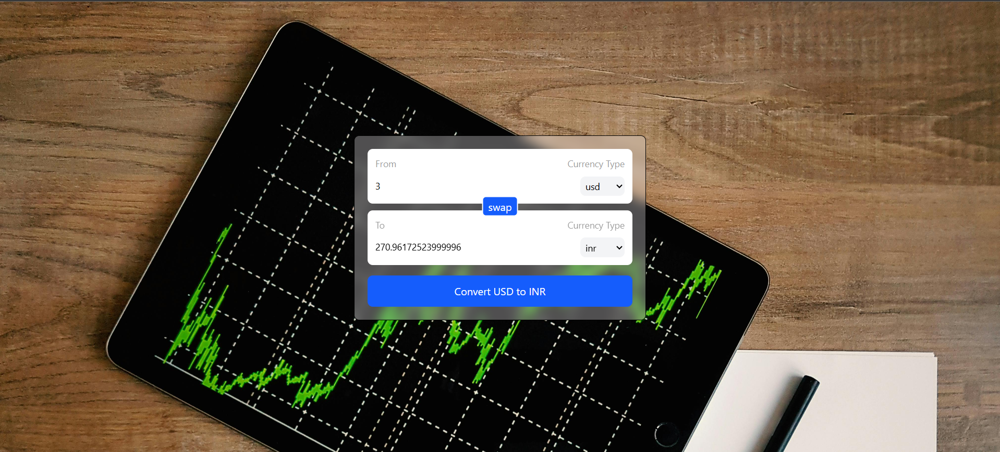

# 💱 Currency Converter App (React)

A simple and responsive **Currency Converter** built using **React**, **custom hooks**, and **Tailwind CSS**.  
It allows users to convert currency values in real-time using live exchange rates.

---

## 🚀 Features

- Convert between multiple currencies
- Swap “From” and “To” currencies instantly
- Real-time exchange rates using public currency API
- Clean and responsive UI
- Custom reusable Input component
- Custom React Hook for API logic
- Controlled inputs for reliable state handling

---

## 🛠️ Tech Stack

- **React** (Hooks)
  - `useState`
  - `useEffect`
  - `useId`
- **Tailwind CSS**
- **JavaScript (ES6+)**
- **Public Currency API**

---

## 📁 Project Structure

src/
│── assets/
│ ├── components/
│ │ └── InputBox.jsx
│ └── hooks/
│ └── useCurrencyInfo.js
│
│── App.jsx
│── App.css
│── main.jsx


---

## 🔗 API Used

Exchange rate data is fetched from:

https://cdn.jsdelivr.net/npm/@fawazahmed0/currency-api


---

## ⚙️ How It Works

1. User enters an amount
2. Selects source and target currency
3. App fetches live exchange rates using a **custom hook**
4. Converted value is calculated and displayed
5. Swap button reverses currencies and values

---

## 🧠 Key Concepts Used

- **Controlled Components**
- **Custom Hooks**
- **Asynchronous Data Fetching**
- **State-driven UI**
- **Component Reusability**

---

## 🖥️ Installation & Setup

1.Clone the repository:

```bash
-git clone https://github.com/your-username/currency-converter.git

2.Navigate to the project folder:

-cd currency-converter

-npm install

-npm run dev


📸 Screenshot
